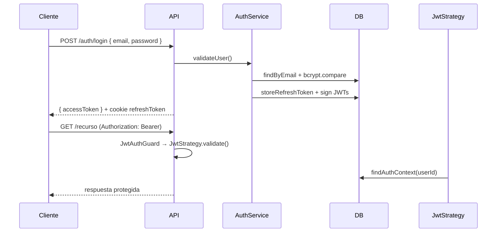

# Auth, Guards, Decorators y utilidades comunes

Guía de referencia para el backend `apps/api` (NestJS + Prisma, ERP multiempresa).

---

## Tabla de contenidos

1. [Visión general de Auth](#visión-general-de-auth)
2. [Flujo de autenticación](#flujo-de-autenticación)
3. [Contextos de request](#contextos-de-request)
4. [Guards](#guards)
5. [Decorators](#decorators)
6. [Utilidades de errores](#utilidades-de-errores)
7. [Multiempresa (tenant)](#multiempresa-tenant)
8. [Validación y respuestas API](#validación-y-respuestas-api)
9. [Observabilidad](#observabilidad)
10. [Ejemplos por módulo](#ejemplos-por-módulo)

---

## Visión general de Auth

El módulo de auth usa **dos tokens**:

| Token | Duración | Transporte | Uso |
|-------|----------|------------|-----|
| **Access token** | 15 min | Header `Authorization: Bearer <token>` | Rutas protegidas (API) |
| **Refresh token** | 7 días | Cookie HTTP-only `refreshToken` | Renovar sesión sin re-login |

El access token solo lleva `{ sub: userId }`. El contexto completo (empresa, rol, sucursal) se **recarga desde la BD** en cada request autenticado vía `JwtStrategy`.

### Endpoints

| Método | Ruta | Protección | Descripción |
|--------|------|------------|-------------|
| `POST` | `/auth/login` | Pública | Valida credenciales, devuelve `accessToken`, setea cookie refresh |
| `POST` | `/auth/refresh` | `JwtRefreshAuthGuard` | Renueva tokens usando cookie |
| `POST` | `/auth/logout` | `JwtRefreshAuthGuard` | Revoca refresh token y borra cookie |
| `GET` | `/auth/me` | `@RequireCompany()` | Devuelve `auth` + `company` del usuario |

### Login (sin Passport Local)

El login valida el body con `LoginDto` + `ValidationPipe` global **antes** de autenticar:

```typescript
@Post('login')
async login(@Body() loginDto: LoginDto, @Res({ passthrough: true }) res: Response) {
  const user = await this.authService.validateUser(loginDto.email, loginDto.password);
  const { accessToken, refreshToken } = await this.authService.login(user);
  setRefreshTokenCookie(res, refreshToken);
  return { accessToken };
}
```

Errores típicos:

- Body inválido → `400 VALIDATION_ERROR`
- Credenciales malas → `401 INVALID_CREDENTIALS`

---

## Flujo de autenticación



### Refresh token en base de datos

- Se guarda **hasheado** (bcrypt), no en texto plano.
- Soporta rotación: al refrescar, el token anterior se revoca y se crea uno nuevo.
- Logout revoca el token en BD.

---

## Contextos de request

Tras autenticación, Express expone estos campos (ver `src/types/express.d.ts`):

| Campo | Cuándo existe | Tipo | Contenido |
|-------|---------------|------|-----------|
| `request.user` | Tras `JwtAuthGuard` | `AuthContext` | Passport lo setea |
| `request.auth` | Tras `JwtAuthGuard` o `CompanyGuard` | `AuthContext` | Alias estable para servicios |
| `request.company` | Tras `CompanyGuard` | `CompanyContext` | Tenant activo |
| `request.requestId` | Siempre (middleware) | `string` | Trazabilidad |

### `AuthContext`

```typescript
type AuthContext = {
  userId: string;
  companyId: string | null;   // de UserCompany.membership
  branchId: string | null;    // defaultBranchId
  role: RoleName | null;      // OWNER, ADMIN, MANAGER, etc.
};
```

Se construye en `toAuthContext()` desde la membership del usuario (`auth/mappers/auth-context.mapper.ts`).

> **Regla del schema:** un usuario tiene **como máximo una empresa** (`UserCompany.userId` es `@unique`).

### `CompanyContext`

```typescript
type CompanyContext = {
  companyId: string;
  branchId: string | null;
  role: RoleName;
};
```

Solo disponible cuando el usuario tiene membership **y** pasó `CompanyGuard`.

---

## Guards

Orden de ejecución en NestJS: **Middleware → Guards → Pipes → Controller**.

### `JwtAuthGuard`

- Archivo: `src/auth/guards/jwt-auth.guard.ts`
- Estrategia Passport: `jwt`
- Lee: `Authorization: Bearer <accessToken>`
- Ejecuta `JwtStrategy.validate()` → carga `AuthContext` desde BD
- Setea: `request.auth = request.user`

**Cuándo usarlo:** cualquier ruta que requiera usuario autenticado.

```typescript
@UseGuards(JwtAuthGuard)
@Get('profile')
getProfile(@Auth() auth: AuthContext) {
  return auth;
}
```

### `JwtRefreshAuthGuard`

- Archivo: `src/auth/guards/jwt-refresh-auth.guard.ts`
- Estrategia: `jwt-refresh`
- Lee refresh token desde **cookie** (no header)
- Setea `request.user` con `{ refreshTokenPayload, refreshTokenFromCookie }`

**Cuándo usarlo:** `/auth/refresh` y `/auth/logout`.

### `CompanyGuard`

- Archivo: `src/common/company/guards/company.guard.ts`
- **Requiere JWT previo** (`JwtAuthGuard` debe ir antes)
- Valida:
  - Usuario autenticado
  - `companyId` presente (membership)
  - `role` presente
- Setea: `request.auth` y `request.company`

**Errores:**

| Caso | HTTP | Código |
|------|------|--------|
| Sin JWT | 401 | `UNAUTHORIZED` |
| Sin empresa | 403 | `UNAUTHORIZED_COMPANY_ACCESS` |
| Sin rol | 403 | `UNAUTHORIZED_COMPANY_ACCESS` |

---

## Decorators

### `@Auth()` — contexto de usuario

- Archivo: `src/auth/decorators/auth.decorator.ts`
- Requiere: `request.auth` (normalmente vía `JwtAuthGuard`)
- Devuelve: `AuthContext`

```typescript
@RequireCompany()
@Get('orders')
list(@Auth() auth: AuthContext) {
  return this.ordersService.findByUser(auth);
}
```

### `@RequireCompany()` — atajo de guards

- Archivo: `src/common/company/decorators/require-company.decorator.ts`
- Aplica: `@UseGuards(JwtAuthGuard, CompanyGuard)` en ese orden

```typescript
@RequireCompany()
@Get('products')
list(@CompanyId() companyId: string) {
  return this.productsService.findByCompany(companyId);
}
```

### `@Company()` — contexto de tenant

- Devuelve: `CompanyContext` completo (`companyId`, `branchId`, `role`)
- Requiere: `CompanyGuard` previo

### `@CompanyId()` — solo el ID de empresa

- Devuelve: `string` (companyId activo)
- Útil para queries Prisma: `where: { companyId }`

---

## Utilidades de errores

Import central:

```typescript
import {
  AuthException,
  BusinessException,
  InventoryException,
  ErrorCodes,
} from 'src/common/errors';
```

### Formato estándar de error

Toda respuesta de error pasa por `GlobalExceptionFilter`:

```json
{
  "success": false,
  "statusCode": 403,
  "message": "No tienes acceso a esta empresa",
  "error": "UNAUTHORIZED_COMPANY_ACCESS",
  "requestId": "5709f9be-fff3-4bb5-9cfe-1b6cabc3b0f7",
  "timestamp": "2026-05-26T16:22:43.853Z",
  "path": "/auth/me"
}
```

### Excepciones disponibles

| Clase | Uso | Ejemplo |
|-------|-----|---------|
| `AuthException` | Auth / sesión / empresa | `AuthException.invalidCredentials()` |
| `BusinessException` | Reglas de negocio genéricas | `BusinessException.notFound(ErrorCodes.CUSTOMER_NOT_FOUND, '...')` |
| `InventoryException` | Stock, productos, caja | `InventoryException.insufficientStock('Tornillo M8')` |

**No crear excepciones por módulo** (`SalesException`, etc.). Usar `BusinessException` + `ErrorCodes`.

### Factories de `AuthException`

```typescript
AuthException.invalidCredentials();           // 401 INVALID_CREDENTIALS
AuthException.unauthorized();                 // 401 UNAUTHORIZED
AuthException.sessionExpired();               // 401 SESSION_EXPIRED
AuthException.unauthorizedCompanyAccess();    // 403 UNAUTHORIZED_COMPANY_ACCESS
```

### Factories de `InventoryException`

```typescript
InventoryException.insufficientStock('Producto X');
InventoryException.productNotFound(productId);
InventoryException.boxClosed();
```

### Prisma sin try/catch

El filter mapea automáticamente:

| Código Prisma | HTTP | Error |
|---------------|------|-------|
| P2002 (unique) | 409 | `EMAIL_ALREADY_EXISTS` o `DUPLICATE_RECORD` |
| P2025 (not found) | 404 | `RECORD_NOT_FOUND` |

```typescript
// ✅ Correcto: dejar propagar
await prisma.user.create({ data: { email, ... } });

// ❌ Evitar try/catch manual para P2002
```

### Códigos internos (`ErrorCodes`)

Ubicación: `src/common/errors/constants/error-codes.ts`

El frontend debe usar `error` (no el texto de `message`) para i18n y lógica:

```typescript
switch (response.error) {
  case ErrorCodes.INVALID_CREDENTIALS:
    // mostrar formulario de login
    break;
  case ErrorCodes.UNAUTHORIZED_COMPANY_ACCESS:
    // redirigir a onboarding de empresa
    break;
}
```

---

## Multiempresa (tenant)

### En controllers (capa HTTP)

Proteger rutas de negocio con `@RequireCompany()`:

```typescript
import { RequireCompany, CompanyId } from 'src/common/company';

@RequireCompany()
@Controller('products')
export class ProductsController {
  @Get()
  findAll(@CompanyId() companyId: string) {
    return this.productsService.findAll(companyId);
  }
}
```

El módulo debe importar `AuthModule` para resolver `JwtAuthGuard` y `CompanyGuard`.

### En services (anti cross-tenant)

Siempre filtrar listados por `companyId` **y** validar recursos por ID:

```typescript
import { assertCompanyAccess } from 'src/common/company';
import type { AuthContext } from 'src/auth/auth.types';

async findOne(id: string, auth: AuthContext) {
  const product = await prisma.product.findUnique({ where: { id } });
  assertCompanyAccess(product?.companyId, auth.companyId);
  return product;
}
```

| Helper | Qué hace |
|--------|----------|
| `assertHasCompanyMembership(companyId)` | Falla 403 si no hay empresa |
| `assertCompanyAccess(resourceCompanyId, currentCompanyId)` | Falla 403 si el recurso es de otra empresa |

> **Importante:** el guard evita usuarios sin tenant; `assertCompanyAccess` evita **IDOR cross-tenant** al cargar por ID.

---

## Validación y respuestas API

### ValidationPipe global

Configurado en `src/bootstrap/create-nest-app.ts`:

- `whitelist: true` — elimina campos no decorados
- `forbidNonWhitelisted: true` — 400 si el cliente manda campos extra
- `transform: true` — convierte tipos (query → number, etc.)

Errores de validación → `400 VALIDATION_ERROR` con `details[]` (solo en dev).

### Respuestas exitosas

`ResponseInterceptor` envuelve todo en:

```json
{
  "success": true,
  "message": "Operación exitosa",
  "data": { ... }
}
```

Si el handler devuelve `{ message: 'Sesión cerrada' }`, el interceptor usa ese mensaje y mueve el resto a `data`.

---

## Observabilidad

### `requestId`

- Middleware: `src/common/middlewares/observability.middleware.ts`
- Corre **antes** de guards (cubre 401/403/500)
- Header respuesta: `x-request-id`
- Body de error: campo `requestId` (para reportes del frontend)

El cliente puede enviar su propio ID:

```http
GET /auth/me
Authorization: Bearer <token>
x-request-id: soporte-ticket-12345
```

### Logs estructurados

Un log JSON por request en consola (`[Observability]`):

```json
{
  "requestId": "...",
  "method": "GET",
  "path": "/auth/me",
  "statusCode": 403,
  "durationMs": 12,
  "userId": "...",
  "companyId": "...",
  "errorCode": "UNAUTHORIZED_COMPANY_ACCESS"
}
```

Para errores 500, `GlobalExceptionFilter` agrega un log técnico complementario (Prisma code, stack en dev).

---

## Ejemplos por módulo

### Controller protegido con tenant

```typescript
import { Controller, Get, Param } from '@nestjs/common';
import { Auth } from 'src/auth/decorators/auth.decorator';
import type { AuthContext } from 'src/auth/auth.types';
import { RequireCompany, CompanyId } from 'src/common/company';

@RequireCompany()
@Controller('invoices')
export class InvoicesController {
  constructor(private readonly invoicesService: InvoicesService) {}

  @Get()
  list(@CompanyId() companyId: string) {
    return this.invoicesService.findAllByCompany(companyId);
  }

  @Get(':id')
  findOne(@Param('id') id: string, @Auth() auth: AuthContext) {
    return this.invoicesService.findOne(id, auth);
  }
}
```

### Service con reglas de negocio

```typescript
import { BusinessException, ErrorCodes, InventoryException } from 'src/common/errors';
import { assertCompanyAccess } from 'src/common/company';

async reserveStock(productId: string, qty: number, auth: AuthContext) {
  const product = await prisma.product.findUnique({ where: { id: productId } });

  assertCompanyAccess(product?.companyId, auth.companyId);

  if (!product) {
    throw InventoryException.productNotFound(productId);
  }

  if (product.stock < qty) {
    throw InventoryException.insufficientStock(product.name);
  }

  // lógica de reserva...
}

async chargePayment(invoiceId: string) {
  const ok = await this.paymentGateway.charge(invoiceId);
  if (!ok) {
    throw new BusinessException(
      ErrorCodes.PAYMENT_FAILED,
      'No se pudo procesar el pago',
    );
  }
}
```

### DTO con validación

```typescript
import { IsEmail, IsNotEmpty, MinLength } from 'class-validator';

export class LoginDto {
  @IsEmail({}, { message: 'El email no es válido' })
  @IsNotEmpty({ message: 'El email es obligatorio' })
  email!: string;

  @MinLength(8, { message: 'La contraseña debe tener al menos 8 caracteres' })
  @IsNotEmpty({ message: 'La contraseña es obligatoria' })
  password!: string;
}
```

---

## Checklist para nuevos endpoints

- [ ] ¿Es público o requiere auth?
- [ ] ¿Es operación de tenant? → `@RequireCompany()`
- [ ] ¿Body/query validado con DTO + class-validator?
- [ ] ¿Listados filtrados por `companyId`?
- [ ] ¿Recursos por ID validados con `assertCompanyAccess`?
- [ ] ¿Errores de negocio con `AuthException` / `BusinessException` / `InventoryException`?
- [ ] ¿Prisma sin try/catch innecesario?

---

## Archivos clave

| Tema | Ruta |
|------|------|
| Auth controller | `src/auth/auth.controller.ts` |
| Auth service | `src/auth/auth.service.ts` |
| JWT strategy | `src/auth/strategies/jwt.strategy.ts` |
| Refresh strategy | `src/auth/strategies/jwt-refresh.strategy.ts` |
| JwtAuthGuard | `src/auth/guards/jwt-auth.guard.ts` |
| Decorator `@Auth` | `src/auth/decorators/auth.decorator.ts` |
| Company guard/helpers | `src/common/company/` |
| Errores globales | `src/common/errors/` |
| Bootstrap app | `src/bootstrap/create-nest-app.ts` |
| Tests e2e contrato | `test/api-contract.e2e-spec.ts` |
| Requests de ejemplo | `http/auth.http` |
