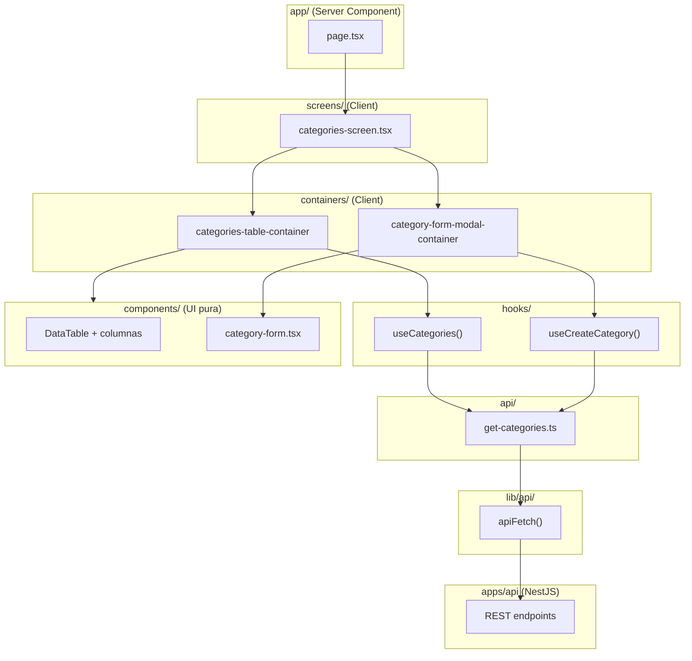

# Guía de arquitectura — `apps/web`

Documento de referencia para el frontend del ERP. Describe **cómo está organizado el código**, **qué responsabilidad tiene cada capa** y **cómo agregar funcionalidad nueva** sin romper la convención del proyecto.

---

## Tabla de contenidos

1. [Filosofía](#1-filosofía)
2. [Stack tecnológico](#2-stack-tecnológico)
3. [Estructura de carpetas](#3-estructura-de-carpetas)
4. [Flujo de datos (visión general)](#4-flujo-de-datos-visión-general)
5. [App Router — solo enrutamiento](#5-app-router--solo-enrutamiento)
6. [Módulos de dominio](#6-módulos-de-dominio)
7. [Capas dentro de un módulo](#7-capas-dentro-de-un-módulo)
8. [Consumo de API (endpoints)](#8-consumo-de-api-endpoints)
9. [TanStack Query — hooks](#9-tanstack-query--hooks)
10. [Mappers — DTO vs UI](#10-mappers--dto-vs-ui)
11. [Formularios — React Hook Form + Zod](#11-formularios--react-hook-form--zod)
12. [Código compartido (`shared/`)](#12-código-compartido-shared)
13. [Tipos globales vs tipos de dominio](#13-tipos-globales-vs-tipos-de-dominio)
14. [Providers y configuración](#14-providers-y-configuración)
15. [Server Components vs Client Components](#15-server-components-vs-client-components)
16. [Guía paso a paso: crear un módulo nuevo](#16-guía-paso-a-paso-crear-un-módulo-nuevo)
17. [Ejemplo real: Categories](#17-ejemplo-real-categories)
18. [Autenticación y RBAC](#18-autenticación-y-rbac)
19. [Variables de entorno](#19-variables-de-entorno)
20. [Comandos útiles](#20-comandos-útiles)
21. [Reglas y anti-patrones](#21-reglas-y-anti-patrones)

---

## 1. Filosofía

El frontend es **únicamente capa de presentación**. Toda la lógica de negocio vive en NestJS (`apps/api`).

Principios clave:

| Principio                        | Qué significa en la práctica                                                                                 |
| -------------------------------- | ------------------------------------------------------------------------------------------------------------ |
| **Feature / Domain First**       | El código se organiza por dominio (`products`, `customers`), no por tipo (`components/`, `hooks/` globales). |
| **`app/` solo enruta**           | Las páginas de Next.js no contienen lógica; delegan en `screens/` del módulo.                                |
| **Un solo cliente HTTP**         | Nunca usar `fetch` directo en componentes. Todo pasa por `apiFetch`.                                         |
| **Components vs Containers**     | Los componentes son visuales; los containers conectan datos (Query/Mutations) con la UI.                     |
| **DTO ≠ UI**                     | Lo que devuelve el API y lo que consume la UI se separan con **mappers**.                                    |
| **Query solo cuando hace falta** | TanStack Query para filtros, paginación, mutaciones. No para pantallas estáticas.                            |

---

## 2. Stack tecnológico

| Librería            | Uso                                         |
| ------------------- | ------------------------------------------- |
| **Next.js 16**      | App Router, Server Components por defecto   |
| **React 19**        | UI                                          |
| **TypeScript**      | Tipado estricto                             |
| **TanStack Query**  | Estado remoto (listas, filtros, mutaciones) |
| **React Hook Form** | Estado de formularios                       |
| **Zod**             | Validación de formularios                   |
| **Sonner**          | Notificaciones toast                        |
| **Tailwind CSS v4** | Estilos globales                            |
| **Lucide React**    | Iconos                                      |

**No se usan:** Redux, MobX, SWR, Axios.

---

## 3. Estructura de carpetas

```
apps/web/
├── public/                    # Assets estáticos
├── src/
│   ├── app/                   # Next.js App Router (SOLO routing)
│   ├── modules/               # Dominios del ERP
│   ├── shared/                # UI reutilizable, data-table, hooks comunes
│   ├── providers/             # Composición de providers globales
│   ├── lib/                   # Utilidades transversales (api, cn)
│   ├── config/                # Configuración (env)
│   ├── constants/             # Constantes globales (theme, page size)
│   └── types/                 # Tipos transversales (pagination, auth)
├── package.json
├── tsconfig.json              # Alias @/* → ./src/*
└── ARCHITECTURE.md            # Este documento
```

### Alias de imports

```ts
import { apiFetch } from "@/lib/api/client";
import { CategoriesScreen } from "@/modules/categories/screens/categories-screen";
import { Button, Modal } from "@/shared/ui";
import type { PaginatedResponse } from "@/types/pagination";
```

---

## 4. Flujo de datos (visión general)



**Regla de oro:** los datos bajan como props; los eventos suben como callbacks. Los **components** no importan hooks de Query ni funciones de `api/`.

---

## 5. App Router — solo enrutamiento

```
src/app/
├── layout.tsx                 # Root layout + AppProviders
├── loading.tsx
├── error.tsx
├── not-found.tsx
├── globals.css
│
├── (public)/
│   └── page.tsx                 # Home pública
│
└── (dashboard)/
    ├── categories/page.tsx
    ├── products/page.tsx
    ├── employees/page.tsx
    ├── suppliers/page.tsx
    ├── companies/page.tsx
    └── companies/[slug]/branch/page.tsx
```

Los **route groups** `(public)` y `(dashboard)` **no afectan la URL**. Sirven para organizar layouts futuros (sidebar, auth guard).

### Convención de página

Cada `page.tsx` es un **Server Component** de una sola responsabilidad:

```tsx
// src/app/(dashboard)/categories/page.tsx
import { CategoriesScreen } from "@/modules/categories/screens/categories-screen";

export default function CategoriesPage() {
  return <CategoriesScreen />;
}
```

**Prohibido en `page.tsx`:** fetch, useState, formularios, tablas, validaciones, tipos de dominio.

### Rutas actuales

| URL                        | Página                                         | Screen                 |
| -------------------------- | ---------------------------------------------- | ---------------------- |
| `/`                        | `(public)/page.tsx`                            | Home + links dev       |
| `/categories`              | `(dashboard)/categories/page.tsx`              | `CategoriesScreen`     |
| `/products`                | `(dashboard)/products/page.tsx`                | `ProductsScreen`       |
| `/employees`               | `(dashboard)/employees/page.tsx`               | `EmployeesScreen`      |
| `/suppliers`               | `(dashboard)/suppliers/page.tsx`               | `SuppliersScreen`      |
| `/sales`                   | `(dashboard)/sales/page.tsx`                   | `SalesScreen`          |
| `/sales-history`           | `(dashboard)/sales-history/page.tsx`           | `SalesHistoryScreen`   |
| `/companies`               | `(dashboard)/companies/page.tsx`               | `CompaniesScreen`      |
| `/companies/[slug]/branch` | `(dashboard)/companies/[slug]/branch/page.tsx` | `BranchesScreen`       |

---

## 6. Módulos de dominio

Cada funcionalidad del ERP vive en `src/modules/{dominio}/`.

### Módulos implementados

| Módulo           | Estado                                                                |
| ---------------- | --------------------------------------------------------------------- |
| `categories`     | Completo (CRUD + tabla)                                               |
| `products`       | Completo (CRUD + tabla + combobox categorías)                         |
| `employees`      | Completo (CRUD transaccional User+Employee + tabla + jerarquía roles) |
| `inventories`    | Completo (CRUD + movimientos + ajustes)                               |
| `mermas`         | Registro de mermas (inventario por sucursal)                          |
| `transferencias` | Transferencias entre sucursales                                       |
| `sales`          | POS / facturación (`/sales`); fecha pasada vía modal + `soldAt`       |
| `sales-history`  | Historial de ventas (`/sales-history`)                                |
| `suppliers`      | Completo (CRUD + tabla)                                               |
| `companies`      | Pantalla legacy migrada (lista + CRUD básico)                         |
| `branches`       | Pantalla legacy migrada (lista + CRUD básico)                         |
| `auth`           | Scaffold (API hooks, sin UI de login aún)                             |
| `users`          | **Provisional** — CRUD en `/users`; ver nota §18.1                    |
| `platform`       | Admin SaaS — `/platform/*` (Super Admin)                              |
| `roles`          | Scaffold RBAC                                                         |
| `permissions`    | Scaffold RBAC                                                         |

### Convención obligatoria de carpeta

Todo módulo nuevo **debe** tener esta estructura (sin excepciones):

```
modules/{dominio}/
├── api/              # Una función por endpoint
├── hooks/            # useQuery / useMutation wrappers
├── components/       # UI pura (sin TanStack Query)
├── containers/       # Conecta hooks → components
├── schemas/          # Validación Zod
├── types/            # Tipos del dominio (Dto + UI)
├── constants/        # Constantes del dominio
├── utils/            # Helpers del dominio
├── mappers/          # Transformaciones Dto ↔ UI
├── screens/          # Pantallas completas
└── query-keys.ts     # Factory de query keys
```

---

## 7. Capas dentro de un módulo

### 7.1 `screens/` — Orquestación

- Archivo principal de la pantalla (ej. `categories-screen.tsx`).
- Marca `"use client"` cuando hay interactividad (modales, filtros).
- **Compone** containers; no llama al API directamente.
- Puede guardar estado de UI local (ej. qué modal está abierto).

```tsx
// Responsabilidad: layout de página + estado de modales
<CategoriesTableContainer onEdit={setModalCategory} onCreate={() => setModalCategory(null)} />
{modalCategory !== undefined && (
  <CategoryFormModalContainer category={modalCategory} onClose={...} />
)}
```

### 7.2 `containers/` — Lógica de datos

- Conocen **TanStack Query** (`useQuery`, `useMutation`).
- Manejan filtros, paginación, debounce de búsqueda.
- Pasan **datos y callbacks** a components / shared.

**Ejemplo:** `categories-table-container.tsx` usa `useCategories`, `useDeleteCategory`, y renderiza `DataTable` + `DataTableToolbar`.

### 7.3 `components/` — UI pura

- Solo reciben **props** (datos + callbacks).
- **No importan:** `useQuery`, `useMutation`, `apiFetch`, archivos de `api/`.
- Pueden usar **React Hook Form** si el container les pasa `onSubmit` y `isSubmitting`.

```tsx
// ✅ Correcto — componente visual
interface CategoryFormProps {
  defaultValues: CategoryFormSchema;
  isSubmitting: boolean;
  onSubmit: (values: CategoryFormSchema) => void | Promise<void>;
  onClose: () => void;
}

// ❌ Incorrecto — componente acoplado al API
function CategoryForm() {
  const mutation = useCreateCategory(); // NO
}
```

### 7.4 Resumen visual

```
┌─────────────────────────────────────────────────────┐
│  screen.tsx          ← compone, estado de modales   │
├─────────────────────────────────────────────────────┤
│  *-container.tsx     ← useQuery, useMutation        │
├─────────────────────────────────────────────────────┤
│  *.tsx (components)  ← props in, eventos out       │
├─────────────────────────────────────────────────────┤
│  shared/ui, data-table ← design system reutilizable  │
└─────────────────────────────────────────────────────┘
```

---

## 8. Consumo de API (endpoints)

### 8.1 Cliente central: `apiFetch`

Ubicación: `src/lib/api/client.ts`

```ts
export async function apiFetch<T>(
  endpoint: string,
  options?: RequestInit & {
    params?: Record<string, string | number | boolean | undefined>;
  },
): Promise<T>;
```

**Comportamiento:**

- Base URL: `NEXT_PUBLIC_API_URL` (default `http://localhost:3001`)
- Envía cookies: `credentials: "include"`
- Si hay token de acceso en `sessionStorage` (tras login), agrega `Authorization: Bearer ...`
- Desempaqueta respuestas NestJS `{ data: T }`
- Si `!response.ok`, lanza `ApiError`

**Manejo de errores:** `src/lib/api/errors.ts`

```ts
import { getErrorMessage, isApiError } from "@/lib/api/errors";

try {
  await mutation.mutateAsync(data);
} catch (error) {
  toast.error(getErrorMessage(error, "Error genérico"));
}
```

### 8.2 Una función por endpoint

Cada operación HTTP vive en su propio archivo dentro de `modules/{dominio}/api/`:

```
modules/categories/api/
├── get-categories.ts       # GET  /categories
├── get-category.ts         # GET  /categories/:id
├── create-category.ts      # POST /categories
├── update-category.ts      # PATCH /categories/:id
├── delete-category.ts      # DELETE /categories/:id
└── toggle-category-status.ts  # PATCH activate/deactivate
```

**Plantilla para GET con filtros:**

```ts
// modules/categories/api/get-categories.ts
import { apiFetch } from "@/lib/api/client";
import type { PaginatedResponse } from "@/types/pagination";
import type { CategoryDto, CategoryFilters } from "../types/category.types";

export async function getCategories(filters?: CategoryFilters) {
  return apiFetch<PaginatedResponse<CategoryDto>>("/categories", {
    params: {
      page: filters?.page,
      take: filters?.take,
      search: filters?.search,
      isActive: filters?.isActive,
    },
  });
}
```

**Plantilla para POST/PATCH:**

```ts
export async function createCategory(data: CategoryFormValues) {
  return apiFetch<CategoryDto>("/categories", {
    method: "POST",
    body: JSON.stringify(data),
  });
}
```

### 8.3 Reglas de endpoints

| Regla                     | Detalle                                                       |
| ------------------------- | ------------------------------------------------------------- |
| **Nunca `fetch` directo** | Excepto utilidades dev temporales (ej. `UsersTester` en home) |
| **Tipos Dto en api/**     | Las funciones retornan `CategoryDto`, no el modelo UI         |
| **Query params**          | Usar `params` de `apiFetch`, no concatenar strings            |
| **Nombre del param**      | Usar `search`, no `q` (contrato del API NestJS)               |

---

## 9. TanStack Query — hooks

### 9.1 Query keys

Cada módulo define un factory en `query-keys.ts`:

```ts
// modules/categories/query-keys.ts
export const categoryKeys = {
  all: ["categories"] as const,
  list: (filters?: CategoryFilters) => ["categories", "list", filters] as const,
  detail: (id: string) => ["categories", "detail", id] as const,
};
```

### 9.2 Query (lectura)

```ts
// modules/categories/hooks/use-categories.ts
export function useCategories(filters?: CategoryFilters) {
  return useQuery({
    queryKey: categoryKeys.list(filters),
    queryFn: async () => mapCategoriesPageToUi(await getCategories(filters)),
  });
}
```

El **mapper** se aplica en `queryFn` para que los containers reciban modelos UI.

### 9.3 Mutation (escritura)

```ts
export function useCreateCategory() {
  const queryClient = useQueryClient();

  return useMutation({
    mutationFn: createCategory,
    onSuccess: () => {
      void queryClient.invalidateQueries({ queryKey: categoryKeys.all });
      toast.success("Categoría creada correctamente");
    },
    onError: (error) => {
      toast.error(getErrorMessage(error, "No se pudo crear la categoría"));
    },
  });
}
```

### 9.4 Cuándo usar TanStack Query

| Usar Query                      | No usar Query                               |
| ------------------------------- | ------------------------------------------- |
| Listas con filtros / paginación | Dashboard estático server-side              |
| Búsqueda con debounce           | Reportes pre-renderizados                   |
| Mutaciones CRUD                 | Metadata que no cambia en sesión            |
| Infinite scroll (combobox)      | `getDashboardMetrics()` en Server Component |

### 9.5 Infinite query (combobox containers)

Patrón estándar: **container** con `useInfiniteQuery` + componente visual reutilizable (`ProductCombobox`, etc.). El formulario **no** importa hooks de datos.

| Container                    | Fuente de datos              | Uso                                     |
| ---------------------------- | ---------------------------- | --------------------------------------- |
| `ProductComboboxContainer`   | `GET /products` (catálogo)   | Alta inventario, ajustes de stock       |
| `InventoryComboboxContainer` | `GET /inventories?branchId=` | Mermas (producto con stock en sucursal) |
| `CategoryComboboxContainer`  | `GET /categories`            | Formulario de producto                  |

Ejemplo de referencia: `CategoryComboboxContainer` en productos.

---

## 10. Mappers — DTO vs UI

El backend y la UI pueden tener formas distintas. La transformación **nunca** va en un componente.

```
modules/{dominio}/mappers/
├── {dominio}.mapper.ts       # Dto → UI
└── {dominio}-form.mapper.ts  # UI form ↔ API payload
```

### Ejemplo: separar Dto de UI

```ts
// types/category.types.ts
export interface CategoryDto {
  // ← lo que devuelve el API
  id: string;
  name: string;
  description: string | null;
  isActive: boolean;
}

export interface Category {
  // ← lo que consume la UI
  id: string;
  name: string;
  description: string | null;
  isActive: boolean;
}
```

```ts
// mappers/category.mapper.ts
export function mapCategoryDtoToUi(dto: CategoryDto): Category {
  return { ...dto };
}

export function mapCategoriesPageToUi(
  response: PaginatedResponse<CategoryDto>,
) {
  return {
    items: response.items.map(mapCategoryDtoToUi),
    meta: response.meta,
  };
}
```

### Ejemplo: Product (Dto con `categoryIds`, UI con `categories`)

```ts
// ProductDto (API) incluye categoryIds + categories
// Product (UI) expone solo categories[] para la tabla
export function mapProductDtoToUi(dto: ProductDto): Product {
  return {
    id: dto.id,
    name: dto.name,
    code: dto.code,
    description: dto.description,
    price: dto.price,
    categories: dto.categories ?? [],
    isActive: dto.isActive,
  };
}
```

```ts
// mappers/product-form.mapper.ts
export function mapProductToFormValues(
  product: Product | null,
): ProductFormSchema {
  return {
    name: product?.name ?? "",
    categoryIds: product?.categories.map((c) => c.id) ?? [],
    // ...
  };
}
```

---

## 11. Formularios — React Hook Form + Zod

### 11.1 Schema Zod

```ts
// modules/categories/schemas/category.schema.ts
import { z } from "zod";

export const categoryFormSchema = z.object({
  name: z.string().min(1, "El nombre es requerido"),
  description: z.string().optional(),
  isActive: z.boolean(),
});

export type CategoryFormSchema = z.infer<typeof categoryFormSchema>;
```

### 11.2 Componente visual del formulario

El **component** usa RHF pero recibe `onSubmit` del container:

```tsx
const { register, handleSubmit, formState: { errors } } = useForm({
  resolver: zodResolver(categoryFormSchema),
  defaultValues,
});

<form onSubmit={(e) => void handleSubmit(onSubmit)(e)}>
```

### 11.3 Container del formulario

```tsx
const createMutation = useCreateCategory();

const handleSubmit = async (values: CategoryFormSchema) => {
  const dto = mapFormValuesToDto(values);
  await createMutation.mutateAsync(dto);
  onClose();
};
```

**Prohibido:** validar con `useState` manual por campo.

---

## 12. Código compartido (`shared/`)

### 12.1 Design system — `shared/ui/`

Punto único de componentes visuales reutilizables:

```
shared/ui/
├── button/
├── input/
├── modal/
├── badge/
├── select/
├── page-header/
├── status-toggle/
└── index.ts          # import { Button, Modal } from "@/shared/ui"
```

**Regla:** los módulos consumen `@/shared/ui`. No duplicar botones/modales por dominio.

### 12.2 Data Table — `shared/data-table/`

Componentes genéricos para listados CRUD:

```
shared/data-table/
├── data-table.tsx              # Tabla con columnas configurables
├── data-table-toolbar.tsx      # Búsqueda + refrescar + crear
├── data-table-pagination.tsx   # Paginación + rows per page
└── types.ts
```

**Uso típico en un container:**

```tsx
<DataTableToolbar
  searchPlaceholder="Buscar categoría..."
  searchValue={searchTerm}
  onSearchChange={handleSearchChange}
  onRefresh={() => void refetch()}
  createLabel="Nueva Categoría"
  onCreate={onCreate}
/>

<DataTable
  title="Lista de Categorías"
  columns={getCategoriesTableColumns({ onEdit, onDelete, onToggleStatus })}
  data={categories}
  loading={isLoading}
  getRowKey={(cat) => cat.id}
  pagination={{ total, currentPage, totalPages, rowsPerPage }}
  onPageChange={setCurrentPage}
  onRowsPerPageChange={setRowsPerPage}
/>
```

Las **columnas** se definen en el módulo (`components/categories-table.tsx`) porque son específicas del dominio.

### 12.3 Hooks compartidos

```
shared/hooks/
└── use-debounced-value.ts    # Debounce para búsqueda (550ms default)
```

---

## 13. Tipos globales vs tipos de dominio

### Tipos globales — `src/types/`

Solo tipos **transversales**:

| Archivo         | Contenido                                        |
| --------------- | ------------------------------------------------ |
| `api.ts`        | `ApiResponse`, `ApiErrorBody`                    |
| `pagination.ts` | `PaginatedResponse`, `PaginationMeta`            |
| `filters.ts`    | `BaseListFilters` (page, take, search, isActive) |
| `sorting.ts`    | `SortParams`, `SortDirection`                    |
| `auth.ts`       | `AuthUser`, `Role`, `Permission`                 |

```ts
import type { PaginatedResponse } from "@/types/pagination";
import type { BaseListFilters } from "@/types/filters";
```

### Tipos de dominio — `modules/{dominio}/types/`

```ts
// ✅ Correcto
import type { Category } from "@/modules/categories/types/category.types";

// ❌ Incorrecto — no poner Product o Category en src/types/
```

---

## 14. Providers y configuración

### Composición global

```tsx
// src/providers/index.tsx
<QueryProvider>
  <AuthProvider>
    <ThemeProvider>
      {children}
      <ToastProvider />
    </ThemeProvider>
  </AuthProvider>
</QueryProvider>
```

| Provider        | Ubicación                      | Responsabilidad                     |
| --------------- | ------------------------------ | ----------------------------------- |
| `QueryProvider` | `providers/query-provider.tsx` | TanStack Query + DevTools (dev)     |
| `AuthProvider`  | `modules/auth/components/`     | Sesión (placeholder hasta login UI) |
| `ThemeProvider` | `providers/theme-provider.tsx` | Tema (placeholder)                  |
| `ToastProvider` | `providers/toast-provider.tsx` | Sonner                              |

### Config

```ts
// src/config/env.ts
export const env = {
  apiUrl: process.env.NEXT_PUBLIC_API_URL ?? "http://localhost:3001",
};
```

---

## 15. Server Components vs Client Components

| Archivo            | Tipo                  | Razón                    |
| ------------------ | --------------------- | ------------------------ |
| `app/**/page.tsx`  | Server (default)      | Solo importa screen      |
| `screens/*.tsx`    | Client                | Filtros, modales, tablas |
| `containers/*.tsx` | Client                | TanStack Query           |
| `components/*.tsx` | Client si hay eventos | Formularios, inputs      |
| `shared/ui/*`      | Server o Client       | Mayoría sin estado       |

**Regla:** no agregar `"use client"` salvo que sea estrictamente necesario.

### Pantallas futuras (dashboard, analytics)

Preferir Server Components con fetch directo en el servidor:

```tsx
// ✅ Dashboard estático
export default async function DashboardPage() {
  const metrics = await getDashboardMetrics(); // server-side, sin React Query
  return <DashboardScreen metrics={metrics} />;
}
```

---

## 16. Guía paso a paso: crear un módulo nuevo

Ejemplo: agregar **Customers** (`/customers`).

### Paso 1 — Crear estructura de carpetas

```
modules/customers/
├── api/
├── hooks/
├── components/
├── containers/
├── schemas/
├── types/
├── constants/
├── utils/
├── mappers/
├── screens/
└── query-keys.ts
```

### Paso 2 — Definir tipos

```ts
// types/customer.types.ts
export interface CustomerDto {
  /* campos del API */
}
export interface Customer {
  /* modelo UI */
}
export type CustomerFilters = BaseListFilters & {
  /* filtros extra */
};
```

### Paso 3 — Crear funciones API

```ts
// api/get-customers.ts
// api/create-customer.ts
// api/update-customer.ts
// api/delete-customer.ts
```

### Paso 4 — Query keys + hooks

```ts
// query-keys.ts
export const customerKeys = { all: ["customers"], list: (f?) => [...], detail: (id) => [...] };

// hooks/use-customers.ts
// hooks/use-create-customer.ts
// etc.
```

### Paso 5 — Mappers

```ts
// mappers/customer.mapper.ts
// mappers/customer-form.mapper.ts
```

### Paso 6 — Schemas Zod

```ts
// schemas/customer.schema.ts
```

### Paso 7 — Components (UI pura)

```ts
// components/customers-table.tsx      → getCustomersTableColumns()
// components/customer-form.tsx
```

### Paso 8 — Containers

```ts
// containers/customers-table-container.tsx
// containers/customer-form-modal-container.tsx
```

### Paso 9 — Screen

```tsx
// screens/customers-screen.tsx
"use client";
export function CustomersScreen() {
  /* compone containers + modales */
}
```

### Paso 10 — Página Next.js

```tsx
// app/(dashboard)/customers/page.tsx
import { CustomersScreen } from "@/modules/customers/screens/customers-screen";

export default function CustomersPage() {
  return <CustomersScreen />;
}
```

### Checklist antes de abrir PR

- [ ] Ningún `component/` importa `useQuery`, `useMutation` ni `api/`
- [ ] Todo HTTP pasa por `apiFetch`
- [ ] Dto y UI separados con mappers
- [ ] Formularios usan RHF + Zod
- [ ] Query keys centralizadas en `query-keys.ts`
- [ ] Tabla reutiliza `shared/data-table`
- [ ] UI reutiliza `@/shared/ui`
- [ ] `pnpm check-types` y `pnpm lint` pasan

---

## 17. Ejemplo real: Categories

### Árbol de archivos

```
modules/categories/
├── api/
│   ├── get-categories.ts
│   ├── create-category.ts
│   ├── update-category.ts
│   ├── delete-category.ts
│   └── toggle-category-status.ts
├── hooks/
│   ├── use-categories.ts
│   ├── use-create-category.ts
│   ├── use-update-category.ts
│   ├── use-delete-category.ts
│   └── use-toggle-category-status.ts
├── components/
│   ├── categories-table.tsx      # Definición de columnas
│   └── category-form.tsx         # Formulario visual
├── containers/
│   ├── categories-table-container.tsx
│   └── category-form-modal-container.tsx
├── mappers/
│   ├── category.mapper.ts
│   └── category-form.mapper.ts
├── schemas/
│   └── category.schema.ts
├── types/
│   └── category.types.ts
├── screens/
│   └── categories-screen.tsx
└── query-keys.ts
```

### Flujo de crear categoría

1. Usuario click **"Nueva Categoría"** → screen setea `modalCategory = null`
2. Se monta `CategoryFormModalContainer`
3. Container usa `useCreateCategory()` mutation
4. `CategoryForm` (component) valida con Zod y llama `onSubmit`
5. Container mapea valores → Dto → `createCategory()` → `apiFetch POST /categories`
6. `onSuccess` invalida queries + toast
7. Modal se cierra; tabla se refresca automáticamente

---

## 18. Autenticación y RBAC

> **Guía práctica (API + web):** [`docs/permissions-guide.md`](../../docs/permissions-guide.md) — `usePermissions`, `<Can>`, sidebar, `route-access`, decoradores NestJS y checklist para nuevos módulos.

### Modelo multiempresa

```
Company (+ isActive)
 └── Branch (+ isActive)
      └── Employee (+ branchId, isActive) → User → Role → Permission[]
```

**Capas de acceso (backend):** ver `apps/api/docs/tenant-access.md`.

- **Empresa inactiva** → `CompanyGuard` bloquea tenant (403).
- **Sucursal inactiva** → `BranchAccessService` bloquea flujos branch-scoped (403).
- **Catálogo** (`products`, `categories`, etc.) → company-wide; no depende de sucursal activa.

### Módulo auth

```
modules/auth/
├── api/get-session.ts      # GET /auth/session + /auth/profile
├── api/switch-branch.ts    # POST /me/switch-branch → nuevo accessToken
├── hooks/use-auth.ts
├── hooks/use-permissions.ts
├── store/auth-store.ts
└── components/auth-provider.tsx
```

`getSession()` reconstruye el usuario desde JWT + perfil BD.

### Permisos en UI

```tsx
import { usePermissions } from "@/modules/auth";
import { Can } from "@/shared/ui";

const { can, isSuperAdmin } = usePermissions();

if (can("products.create")) { ... }   // RBAC tenant (desde JWT)
if (isSuperAdmin) { ... }             // plataforma — NO bypass en can()
```

```tsx
<Can permission="users.delete">
  <DeleteUserButton />
</Can>
```

**Reglas:**

- `isSuperAdmin` **no** otorga permisos tenant en `can()` / `<Can>`.
- El backend (`PermissionGuard`) es la autoridad real; la UI solo oculta controles.

**Facturación — fecha pasada:** la ruta `/sales` se abre con `sales.create`. El modal/botón “Fecha de venta” solo se muestra si `can(Permission.SALES_BACKDATE)` (OWNER/ADMIN); no es una pantalla ni ítem de nav nuevo. El payload envía `soldAt` opcional en `POST /sales`; la API valida el permiso en servicio.

Documentación API: `apps/api/docs/auth-and-utilities.md`. Revisión de riesgos: `docs/security-rbac-critical-review.md`.

### Jerarquía de roles (UI)

Además de permisos RBAC, usuarios y empleados aplican `canManageTargetRole` (`shared/auth/role-hierarchy.ts`):

- **Usuarios:** `users-table-container` + `assertCanManageUser` (API).
- **Empleados:** `employee-access.ts` + `employee-management.policy.ts` (API).

Ver `docs/permissions-guide.md` y `docs/employee-user-registration-flow.md` §8.2.

### 18.1 Gestión de usuarios en web (provisional)

La pantalla `/users` y el módulo `modules/users/` son **provisionales**. Implementan un CRUD tenant genérico (`GET|POST|PATCH|DELETE /users`) pero **no** reflejan el diseño final de gestión de identidades.

| Tema                 | Estado actual                           | Objetivo                                                                                  |
| -------------------- | --------------------------------------- | ----------------------------------------------------------------------------------------- |
| Super Admin vs Owner | Misma UI para cualquier rol con permiso | Pantallas y flujos separados (plataforma vs tenant)                                       |
| Alta de usuarios     | Formulario «crear usuario» en tenant    | Owner **invita** miembros a su empresa; Super Admin crea tenant + owner vía `/platform/*` |
| Quitar acceso        | Botón «Eliminar» → `DELETE /users/:id`  | Owner **expulsa** (solo membresía `UserCompany`); **no** elimina la cuenta global         |
| Eliminar cuenta      | Expuesto si `can('users.delete')`       | Reservado a **plataforma** (Super Admin)                                                  |

**Reglas de diseño acordadas (pendientes de implementar):**

- El **Owner** puede invitar y gestionar usuarios de **su** empresa, pero **no** debería poder eliminarlos del sistema — solo **expulsarlos** de la empresa.
- El **Super Admin** crea empresas, el owner inicial y cuentas de plataforma; no sustituye al Owner en la operación diaria del tenant.
- Personal operativo con ficha laboral sigue dándose de alta por **`/employees`** (`POST /employees`), no por sustituir ese flujo con `/users`.

Documentación completa: [`docs/user-management-roadmap.md`](../../docs/user-management-roadmap.md).  
Revisión de seguridad y backlog: [`docs/security-rbac-critical-review.md`](../../docs/security-rbac-critical-review.md).

### 18.2 Super Admin — plataforma (`/platform/*`)

Separado del RBAC tenant. Usa `isSuperAdmin` del JWT, **no** `can()` ni `<Can>`.

| Componente            | Uso                                                  |
| --------------------- | ---------------------------------------------------- |
| `PlatformGuard`       | Protege layout `(platform)` — solo Super Admin       |
| `CanPlatformAdmin`    | Equivalente UI de `@RequirePlatformAdmin()`          |
| `PlatformSidebar`     | Nav: panel + empresas (+ enlace ERP si tiene tenant) |
| `getPostLoginRoute()` | Super Admin sin `companyId` → `/platform/dashboard`  |

Rutas web:

| URL                   | Pantalla                                    |
| --------------------- | ------------------------------------------- |
| `/platform/dashboard` | Métricas de tenants                         |
| `/platform/companies` | Alta/suspensión de empresas + owner inicial |

API: `GET|POST /platform/companies`, `GET /platform/overview` — ver `docs/platform-admin-roadmap.md`.

El ítem **Admin SaaS** en el sidebar tenant (`access: { type: "platform" }`) enlaza a plataforma cuando el Super Admin también opera un tenant.

---

## 19. Variables de entorno

Archivo: `apps/web/.env.development`

| Variable              | Descripción                                           |
| --------------------- | ----------------------------------------------------- |
| `NEXT_PUBLIC_API_URL` | URL base del API NestJS (ej. `http://localhost:3001`) |

Ejemplos en `.env.development.example` y `.env.staging.example`.

---

## 20. Comandos útiles

```bash
# Desde apps/web o raíz del monorepo
pnpm dev              # Next.js en puerto 3000
pnpm dev:staging      # Con .env.staging
pnpm build            # Build producción
pnpm check-types      # TypeScript
pnpm lint             # ESLint (max-warnings 0)
```

---

## 21. Reglas y anti-patrones

### ✅ Hacer

- Organizar por dominio en `modules/`
- Mantener `page.tsx` delgadas (1 componente)
- Separar Dto / UI con mappers
- Invalidar queries tras mutaciones
- Usar `getErrorMessage()` para toasts de error
- Reutilizar `DataTable` y `@/shared/ui`

### ❌ No hacer

| Anti-patrón                           | Por qué                                 |
| ------------------------------------- | --------------------------------------- |
| `fetch()` directo en components       | Sin manejo centralizado de auth/errores |
| Lógica de negocio en frontend         | Debe estar en NestJS                    |
| Redux / MobX / SWR / Axios            | No están en el stack del proyecto       |
| Tipos de dominio en `src/types/`      | Contamina tipos globales                |
| `useQuery` en Server Components       | No compatible                           |
| Tablas copy-paste por módulo          | Usar `shared/data-table`                |
| Validación manual con `useState`      | Usar RHF + Zod                          |
| Excepciones a la estructura de módulo | Rompe escalabilidad del ERP             |

---

## Referencia rápida

```
¿Dónde va X?

  Ruta URL              → app/(dashboard)/{ruta}/page.tsx
  Pantalla completa     → modules/{dominio}/screens/
  Lógica Query/Mutation → modules/{dominio}/containers/
  UI sin datos          → modules/{dominio}/components/
  Llamada HTTP          → modules/{dominio}/api/  →  apiFetch
  Hook de datos         → modules/{dominio}/hooks/
  Validación form       → modules/{dominio}/schemas/
  Dto ↔ UI              → modules/{dominio}/mappers/
  Botón, Modal, Input   → @/shared/ui
  Tabla paginada        → @/shared/data-table
  Paginación genérica   → @/types/pagination
  Auth / permisos       → @/modules/auth
```

---

_Estructura actual: containers, mappers, data-table, RBAC tenant (`usePermissions`, `<Can>`). Gestión de usuarios web: **provisional** (§18.1). Ver `docs/user-management-roadmap.md`._
