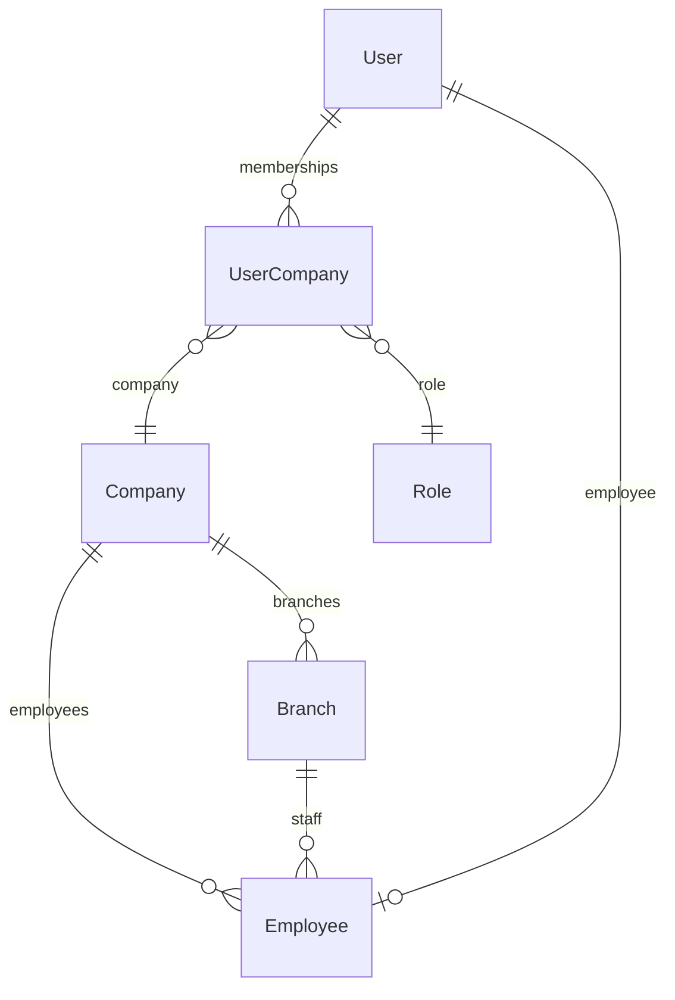
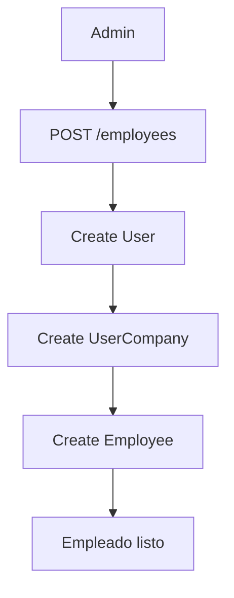

# Flujo de registro: Employee y User

Este documento describe cómo el ERP multiempresa modela a los **empleados operativos**: personas que utilizan el sistema y tienen registro laboral en la empresa.

---

## Decisión de negocio

```text
Todo Employee tiene acceso al ERP.
```

`Employee` representa exclusivamente usuarios operativos del sistema. No se registran choferes, mensajeros ni personal externo sin interacción con el ERP.

Cada alta de empleado crea obligatoriamente:

```text
User → UserCompany → Employee
```

en una sola transacción.

---

## 1. Responsabilidades por modelo

| Modelo        | Responsabilidad                                                       |
| ------------- | --------------------------------------------------------------------- |
| `User`        | Autenticación: email, contraseña, nombre de sesión, `lastLoginAt`     |
| `UserCompany` | Autorización tenant: empresa, rol, sucursal por defecto               |
| `Employee`    | Datos laborales: teléfono, puesto, salario, fechas, sucursal asignada |

### User

```text
email
passwordHash
firstName
lastName
lastLoginAt
```

### UserCompany

```text
companyId
roleId
defaultBranchId
```

### Employee

```text
companyId   (obligatorio)
branchId      (obligatorio)
userId        (obligatorio, único)
phone
position
salary
hireDate
terminationDate
```

---

## 2. Arquitectura de relaciones

```text
Company
 └── Branch
      └── Employee
           └── User (1:1)
                └── UserCompany (membresía en la empresa)
```



---

## 3. Reglas de integridad

| Estado                              | Válido |
| ----------------------------------- | ------ |
| `companyId` + `branchId` + `userId` | Sí     |
| `userId = null`                     | **No** |
| `branchId = null`                   | **No** |
| `companyId = null`                  | **No** |

---

## 4. Crear empleado

**Endpoint único:**

```http
POST /employees
```

Requiere `@RequireCompany()` (JWT + empresa activa).

### Body

```json
{
  "firstName": "Maria",
  "lastName": "Rodriguez",
  "phone": "8095559999",
  "email": "maria@empresa.com",
  "password": "12345678",
  "roleId": "clxxxxxxxx",
  "branchId": "branch_id",
  "position": "Cajera",
  "salary": 25000,
  "hireDate": "2026-01-15"
}
```

> `roleId` es el id del rol (`GET /users/roles`), no el nombre del enum.

### Flujo transaccional



Pasos internos:

```text
BEGIN TRANSACTION
1. Validar roleId y branchId ∈ companyId
2. INSERT User
3. INSERT UserCompany (companyId, roleId, defaultBranchId)
4. INSERT Employee (companyId, branchId, userId, datos laborales)
COMMIT
```

Si cualquier paso falla → `ROLLBACK`.

---

## 5. Endpoints vigentes

| Método   | Ruta                     | Descripción                         |
| -------- | ------------------------ | ----------------------------------- |
| `GET`    | `/employees`             | Listado paginado (`companyId`)      |
| `GET`    | `/employees/:id`         | Detalle                             |
| `POST`   | `/employees`             | Crear User + UserCompany + Employee |
| `PATCH`  | `/employees/:id`         | Actualizar datos laborales          |
| `DELETE` | `/employees/:id`         | Soft delete                         |
| `PATCH`  | `/employees/:id/restore` | Restaurar eliminado                 |

### Endpoints eliminados (ya no aplican)

```http
POST   /employees/create-user      (fusionado en POST /employees)
POST   /employees/:id/link-user
DELETE /employees/:id/unlink-user
```

No existe el concepto de empleado sin usuario.

---

## 6. Listado y búsqueda

`GET /employees` filtra por `companyId` del contexto.

Query opcional: `page`, `take`, `search`, `isActive`, `branchId`.

La búsqueda incluye nombre, teléfono, puesto y **email del usuario** vinculado.

---

## 7. Soft delete

Al eliminar un empleado:

- `deletedAt` se establece
- `isActive` pasa a `false`

`PATCH /employees/:id/restore` revierte `deletedAt` sin reactivar `isActive` automáticamente.

---

## 8. Frontend

Módulo: `src/modules/employees/`

- Un solo flujo de alta: modal **Nuevo Empleado** con email, contraseña, rol y datos laborales.
- Edición: solo datos laborales; el email se muestra en solo lectura.
- Tabla: nombre, email, sucursal, puesto, estado.
- Acciones en tabla: además de permisos RBAC (`EMPLOYEES_UPDATE` / `EMPLOYEES_DELETE`), se aplica **jerarquía de roles** (`canManageTargetRole` en web; `assertCanManageUser` en API). Ver §8.2.

### 8.2 Gestión por jerarquía de roles

Archivo API: `src/employees/policies/employee-management.policy.ts`  
Archivo web: `src/modules/employees/utils/employee-access.ts` (usa `shared/auth/role-hierarchy.ts`).

| Acción                     | Regla                                                                                                   |
| -------------------------- | ------------------------------------------------------------------------------------------------------- |
| **Editar** otro empleado   | Solo si el rol del actor es **estrictamente superior** al del objetivo (p. ej. Admin no edita Owner).   |
| **Editar** propio registro | Permitido (datos laborales: teléfono, sucursal, puesto, etc.).                                          |
| **Eliminar**               | Misma jerarquía que editar; además **Owner y Admin no pueden eliminar su propio** registro de empleado. |
| **Restaurar**              | Mismas reglas que editar.                                                                               |

Nota: en `/users`, la eliminación propia está bloqueada para **todos** los roles (`users.service`). En `/employees` el recurso es el registro HR; la restricción de auto-eliminación aplica solo a Owner/Admin según política de negocio.

---

## 8.1 Política empleado ↔ sucursal (operaciones)

Documentación completa: `apps/api/docs/tenant-access.md` y `src/employees/policies/employee-branch.policy.ts`.

| Regla              | Detalle                                                                                                                       |
| ------------------ | ----------------------------------------------------------------------------------------------------------------------------- |
| Asignación         | Cada empleado tiene **una** sucursal (`employee.branchId`).                                                                   |
| Alta               | `POST /employees` exige `branchId` activo (`BranchAccessService`).                                                            |
| Reasignación       | `PATCH /employees/:id` con nuevo `branchId`; sucursal destino activa.                                                         |
| Caja (`open`/`close`) | La sucursal se toma de la **caja** (no del JWT). Cajeros: solo su sucursal de empleado. Supervisores con `branches.read`: pueden operar otras sucursales. |
| `switchBranch`     | Cambia sucursal por defecto del JWT; **no** mueve al empleado. Para caja, JWT y empleado deben coincidir en sucursal.         |

---

## 9. Roadmap futuro (no implementado)

Administración de plataforma con `SUPER_ADMIN` para crear empresas y owners iniciales. Ver `docs/platform-admin-roadmap.md`.

Gestión de usuarios tenant (invitar, expulsar, separación Owner / Super Admin): ver `docs/user-management-roadmap.md`.

---

## 10. Justificación

El ERP solo gestiona personas que interactúan con el sistema. Esto simplifica schema, API, validaciones, permisos y frontend, y mantiene una base limpia para RBAC y extensiones de RRHH.
