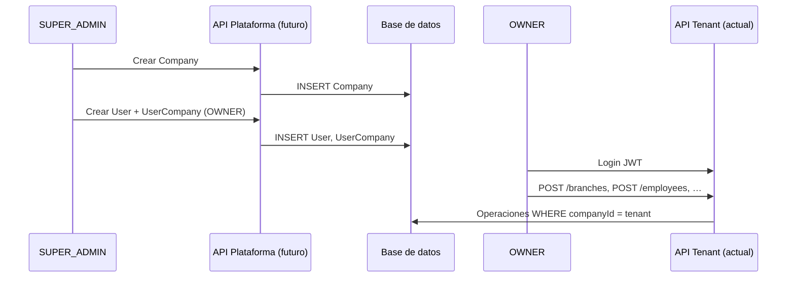
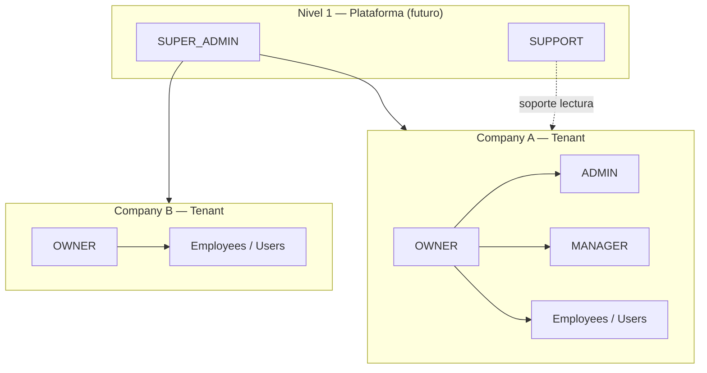
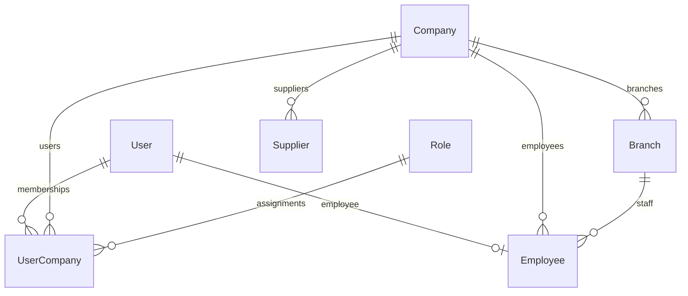

# Roadmap: administración de plataforma y RBAC multi-nivel

Este documento describe la **evolución planificada** del ERP multiempresa hacia un modelo de autorización en dos niveles: **plataforma (SaaS)** y **empresa (tenant)**.

> **Importante:** esto es documentación de arquitectura futura. **No implementar ahora.**  
> La fase actual del proyecto está cubierta correctamente por `JWT` → `CompanyGuard` → `companyId` y por `User` / `UserCompany` / `Role` tenant-scoped.

---

## Estado actual (fase vigente)

### Modelos relevantes

```text
User
Role
UserCompany
Company
Branch
Employee
Supplier
```

### Flujo de autorización en rutas de negocio

Todas las rutas de empleados, proveedores, productos, categorías, etc. asumen:

```text
Usuario autenticado (JWT)
        ↓
CompanyGuard  (@RequireCompany)
        ↓
companyId  (membresía activa en UserCompany)
        ↓
Operaciones scoped a esa empresa
```

Eso es **correcto y suficiente** para la fase actual: un usuario con membresía en una empresa opera dentro de ese tenant.

### Lo que el sistema asume hoy

```text
Usuario autenticado
        ↓
Tiene UserCompany (membresía)
        ↓
Tiene companyId + role (OWNER, ADMIN, MANAGER, …)
```

### Lo que **no** existe aún

No hay un actor de plataforma capaz de:

```text
Crear empresas
Suspender empresas
Activar empresas
Asignar owners iniciales
Administrar el SaaS completo
Ver métricas globales cross-tenant
```

Ese hueco se cubrirá en una fase posterior con **Platform Roles** (p. ej. `SUPER_ADMIN`, `SUPPORT`).

### Qué **no** debe cambiarse en esta fase

- Módulos `Employee` y `Supplier` (API y schema actuales).
- Modelo `UserCompany` y su relación con `Role` tenant-scoped.
- Patrón `CompanyGuard` para rutas de tenant.

La implementación actual es la base correcta; este roadmap solo anticipa la capa de plataforma.

---

## Visión: dos niveles de autorización

El ERP se implementará con **dos dominios de permisos** separados explícitamente. En arquitecturas SaaS multi-tenant maduras, los roles globales (plataforma) y los roles por tenant (empresa) suelen vivir en capas distintas porque su **alcance** y **riesgo** son diferentes.

| Nivel | Alcance | Pregunta que responde |
|-------|---------|------------------------|
| **1 — Plataforma** | Todo el SaaS | ¿Quién administra el producto y los tenants? |
| **2 — Empresa (tenant)** | Una `Company` | ¿Quién administra esta empresa concreta? |

---

## Nivel 1 — Plataforma (futuro)

### Responsabilidad

```text
Administrar el SaaS completo
```

### Roles futuros (Platform Roles)

```text
SUPER_ADMIN
SUPPORT
```

### Características clave

- Estos usuarios **no pertenecen a una empresa** en el sentido operativo del ERP.
- **No** deben modelarse como filas en `UserCompany` con un rol “especial”.
- Son **Platform Roles**: permisos cross-tenant, fuera del scope `companyId`.

### Capacidades planeadas

| Acción | SUPER_ADMIN | SUPPORT (típico) |
|--------|-------------|------------------|
| Crear empresas | Sí | No / limitado |
| Suspender empresas | Sí | Según política |
| Activar empresas | Sí | Según política |
| Crear Owner inicial | Sí | No |
| Ver métricas globales | Sí | Lectura parcial |
| Dar soporte (impersonación / lectura) | Sí | Sí |

### Guard / contexto futuro (conceptual)

Hoy: `CompanyGuard` exige `companyId`.

Futuro (no implementado): algo equivalente a `PlatformGuard` que valide `platformRole` **sin** exigir tenant, o rutas bajo prefijo `/platform/*` separadas de `/companies/*` tenant-scoped.

---

## Nivel 2 — Empresa / tenant (actual + evolución RBAC)

### Responsabilidad

```text
Administrar una empresa específica
```

### Roles (Company Roles) — ya en schema

```text
OWNER
ADMIN
MANAGER
CASHIER
INVENTORY_ASSISTANT
```

Definidos en el enum `RoleName` y asignados vía **`UserCompany`**.

### Modelo mental

```text
User
  ↓
UserCompany   (membresía: userId + companyId + roleId)
  ↓
Company
  ↓
Role          (tenant-scoped: el rol solo tiene sentido dentro de esa empresa)
```

Las asignaciones de rol **siempre** se evalúan en el contexto de **una** empresa. Un mismo `User` puede tener distintos roles en distintas empresas (distintas filas `UserCompany`), pero cada operación tenant-scoped usa el `companyId` activo del JWT / sesión.

### Relación con Employee

```text
Employee
  ├─ companyId  (obligatorio)
  ├─ branchId   (obligatorio)
  └─ userId     (obligatorio — todo empleado tiene acceso al ERP)
```

`Employee` es RRHH vinculado 1:1 a `User`. Alta vía `POST /employees` (transacción User + UserCompany + Employee). Ver `docs/employee-user-registration-flow.md`.

---

## Comparación: Platform Roles vs Company Roles

| Aspecto | Platform Roles | Company Roles |
|---------|----------------|---------------|
| Ejemplos | `SUPER_ADMIN`, `SUPPORT` | `OWNER`, `ADMIN`, `CASHIER`, … |
| Tabla / campo | Futuro: `User.platformRole` o tabla dedicada | `UserCompany.roleId` → `Role` |
| Scope | Cross-tenant (todo el SaaS) | Una `Company` |
| ¿Usa `CompanyGuard`? | No (rutas de plataforma) | Sí (rutas de negocio) |
| ¿Vive en `UserCompany`? | **No** | **Sí** |
| Implementado hoy | No | Sí (sin `RolesGuard` fino aún) |

---

## ¿Qué es un SUPER_ADMIN?

Actor de **plataforma** (operador del SaaS), no empleado ni dueño de una tienda.

- Puede crear tenants (`Company`) y el primer `OWNER`.
- No reemplaza al `OWNER` dentro de la empresa: el Owner configura sucursales, empleados, catálogo, etc.
- No debe confundirse con `RoleName.OWNER`: el Owner es **tenant-scoped**; el Super Admin es **platform-scoped**.

```text
SUPER_ADMIN     →  opera el producto (muchas empresas)
OWNER           →  opera su empresa (una Company)
```

---

## Flujo futuro de onboarding (planeado)

### Paso 1 — Super Admin crea empresa

```text
SUPER_ADMIN
      ↓
POST /platform/companies   (ruta futura, ejemplo)
      ↓
Company creada (slug, nombre, estado)
```

### Paso 2 — Super Admin crea Owner inicial

```text
SUPER_ADMIN
      ↓
Create User (email, password, firstName, lastName)
      ↓
Create UserCompany
  - companyId = empresa nueva
  - roleId    = OWNER
      ↓
(Opcional) Create Employee vinculado al mismo User
```

El Owner es el primer usuario con poder administrativo **dentro** del tenant.

### Paso 3 — Owner accede al ERP

```text
OWNER (JWT + CompanyGuard + companyId)
      ↓
Configura sucursales (Branch)
      ↓
Invita o crea más usuarios (futuro RBAC por rol)
```

### Paso 4 — Owner registra empleados

```http
POST /employees
```

Crea en una transacción: `User` + `UserCompany` + `Employee`.

### Paso 5 — Owner administra su empresa

Dominios tenant-scoped (actuales o por venir):

```text
Productos · Categorías · Proveedores · Inventario · Ventas · Caja · …
```

Todo con el mismo patrón: `JWT` → `CompanyGuard` → `companyId`.



---

## Jerarquía objetivo (fase futura)

```text
SUPER_ADMIN  (plataforma)
        │
        ├── Company A
        │      ├── OWNER
        │      ├── ADMIN
        │      ├── MANAGER
        │      ├── CASHIER / INVENTORY_ASSISTANT (vía UserCompany)
        │      └── EMPLOYEES (RRHH; algunos con User vinculado)
        │
        ├── Company B
        │      ├── OWNER
        │      └── EMPLOYEES / usuarios…
        │
        └── Company C
               └── …
```



---

## Evolución futura del schema (referencia — NO IMPLEMENTAR AHORA)

Hoy `User` no tiene roles de plataforma. Solo se relaciona con empresas mediante `UserCompany`.

### Opción A — campo en `User`

```prisma
// FASE FUTURA — NO APLICAR EN ESTA ITERACIÓN

enum PlatformRole {
  SUPER_ADMIN
  SUPPORT
}

model User {
  // ... campos actuales ...
  platformRole PlatformRole?
}
```

- `platformRole = null` → usuario “normal” (solo tenant vía `UserCompany`).
- `platformRole = SUPER_ADMIN` → rutas de plataforma sin depender de `UserCompany`.

### Opción B — tabla dedicada

```prisma
// FASE FUTURA — ilustrativo

model PlatformMembership {
  id     String @id @default(cuid())
  userId String @unique
  role   PlatformRole
  user   User   @relation(...)
}
```

Útil si más adelante hay varios roles de plataforma con metadatos (expiración, auditoría, etc.).

### Por qué no implementar ahora

```text
CompanyGuard + UserCompany + Role (tenant)
```

cubren **todos** los requisitos funcionales de la fase actual:

- Multiempresa por membresía.
- Empleados y proveedores por `companyId`.
- Usuarios con rol por empresa.

Añadir `SUPER_ADMIN` antes de definir rutas `/platform/*`, guards y políticas de soporte solo añadiría complejidad y superficie de error sin entregar valor inmediato.

---

## Interacción User · UserCompany · Company (resumen)

| Entidad | Rol en el sistema |
|---------|-------------------|
| `User` | Identidad global (email, contraseña, perfil). Puede tener 0..N membresías tenant y 0..1 `Employee`. |
| `Company` | Tenant / empresa cliente del SaaS. |
| `UserCompany` | Une `User` + `Company` + `Role` (tenant). Es la fuente de verdad del **rol empresarial**. |
| `Role` | Catálogo de roles **por tenant** (`RoleName`). |
| `Branch` | Sucursal; `Employee.branchId` obligatorio. |
| `Employee` | Usuario operativo del ERP; `userId` obligatorio. |



**Futuro:** `User` podría además tener `platformRole` (o tabla equivalente) **sin** fila en `UserCompany` para operadores del SaaS.

---

## RBAC tenant: estado y siguiente paso

| Capacidad | Estado |
|-----------|--------|
| Membresía por empresa (`UserCompany`) | Implementado |
| `CompanyGuard` + `companyId` | Implementado |
| Enum `RoleName` en DB | Implementado |
| `RolesGuard` / `@Roles()` en controladores | Pendiente (TODOs en código) |
| Platform admin / `SUPER_ADMIN` | Documentado aquí; **no implementado** |

Cuando se implemente RBAC completo en tenant, los permisos se derivarán de `UserCompany.role` dentro del `companyId` del JWT — no de roles de plataforma.

---

## Documentos relacionados

| Archivo | Contenido |
|---------|-----------|
| `docs/employee-user-registration-flow.md` | Employee siempre con User; `POST /employees` transaccional |
| `docs/platform-admin-roadmap.md` | Este archivo — plataforma vs tenant, SUPER_ADMIN, onboarding futuro |
| `packages/database/prisma/schema.prisma` | Schema vigente |
| `apps/api/docs/auth-and-utilities.md` | Auth, guards, errores (si aplica) |

---

## Conclusión para el equipo

1. **La implementación actual es correcta** para la fase del proyecto: no refactorizar Employee, Supplier ni UserCompany por este roadmap.
2. **Falta solo documentación de evolución** hacia administración de plataforma y RBAC fino — este documento cumple ese rol.
3. **Platform Roles** (`SUPER_ADMIN`, `SUPPORT`) y **Company Roles** (`OWNER`, `ADMIN`, …) deben permanecer **conceptual y físicamente separados** cuando se implemente la fase 2.
4. El onboarding de nuevos clientes del SaaS seguirá: **Super Admin crea Company + Owner** → **Owner opera el tenant** con las APIs existentes (`/employees`, `/suppliers`, etc.) bajo `CompanyGuard`.

**Fase futura del ERP — no bloqueante para el desarrollo actual.**
